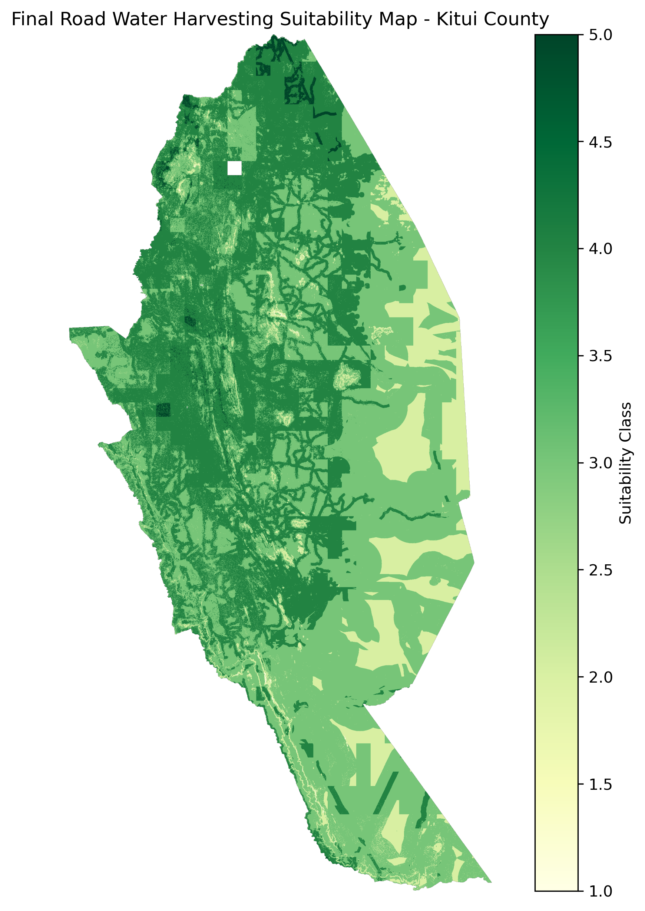

# Kitui Road Water Harvesting Suitability Mapping

This project maps suitable areas for road water harvesting in Kitui County, Kenya using GIS, remote sensing, Python, and raster-based weighted overlay analysis.

The project is based on a final year geospatial engineering study that used multi-criteria suitability analysis to identify potential sites for road water harvesting structures in Kitui County.

## Project Objective

The main objective is to identify suitable areas for road water harvesting interventions in Kitui County by combining environmental and proximity-based criteria.

The suitability analysis considers:

- Rainfall
- Slope
- Land cover
- Soil depth
- Soil type
- Distance to roads
- Distance to agricultural areas

## Study Area

The study area is Kitui County, Kenya. Kitui is located in a semi-arid region and experiences water scarcity, unreliable rainfall, and high dependence on rain-fed agriculture.

## Methodology

The project uses a raster-based GIS workflow. The main processing steps include:

1. Loading and preparing spatial datasets
2. Reprojecting datasets to EPSG:32737
3. Clipping datasets to Kitui County
4. Deriving slope from DEM
5. Reclassifying criteria into suitability scores from 1 to 5
6. Creating distance rasters for roads and agricultural areas
7. Aligning all raster layers to a common 100 m grid
8. Applying weighted overlay analysis
9. Producing the final road water harvesting suitability map

## Suitability Criteria

Each criterion was reclassified into suitability scores:

| Score | Meaning |
|---|---|
| 1 | Not suitable |
| 2 | Less suitable |
| 3 | Moderately suitable |
| 4 | Suitable |
| 5 | Highly suitable |

## AHP-Based Weighted Overlay

The final suitability map was produced by combining the reclassified criteria using weighted overlay.

Initial weights used in this project:

| Criterion | Weight |
|---|---:|
| Rainfall | 0.25 |
| Slope | 0.20 |
| Soil type | 0.15 |
| Soil depth | 0.15 |
| Land cover | 0.10 |
| Distance to roads | 0.10 |
| Distance to agriculture | 0.05 |

The weights sum to 1.00.

## Current Outputs

The project has produced a final classified road water harvesting suitability map for Kitui County.



## Tools and Libraries

The project uses:

- Python
- GeoPandas
- Rasterio
- NumPy
- Matplotlib
- SciPy
- QGIS
- Git and GitHub

## Project Structure

```text
kitui-rwh-python-postgis/
│
├── data/
│   ├── raw/
│   └── processed/
│
├── notebooks/
│   └── 02_raster_processing.ipynb
│
├── outputs/
│   └── maps/
│       └── kitui_rwh_final_suitability_map.png
│
├── README.md
└── requirements.txt

## Note on Data

Large raw and processed GIS datasets are not included in this repository to keep the project lightweight. The repository focuses on the workflow, methodology, code, and final map outputs.

## Author

Charles Milemba  
B.Sc. Geospatial Engineering  
charlesmilemba42@gmail.com